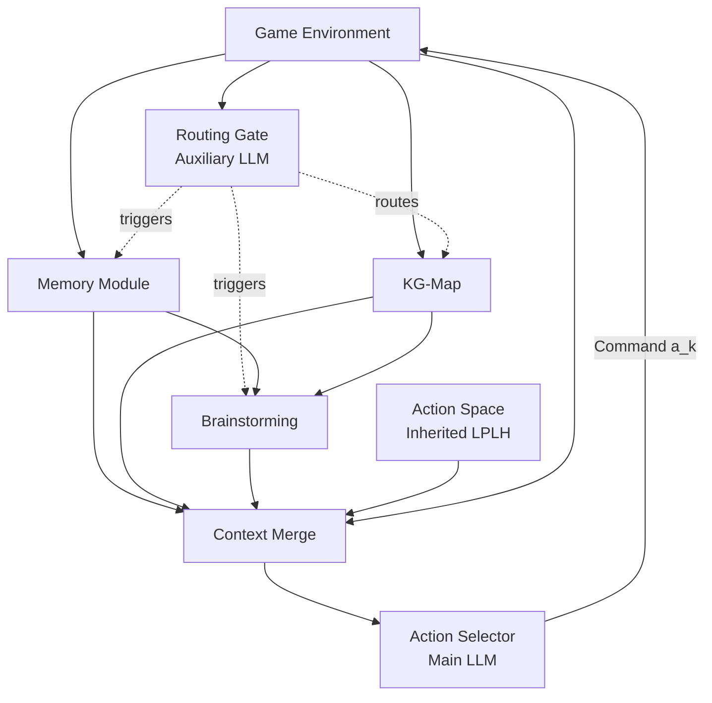
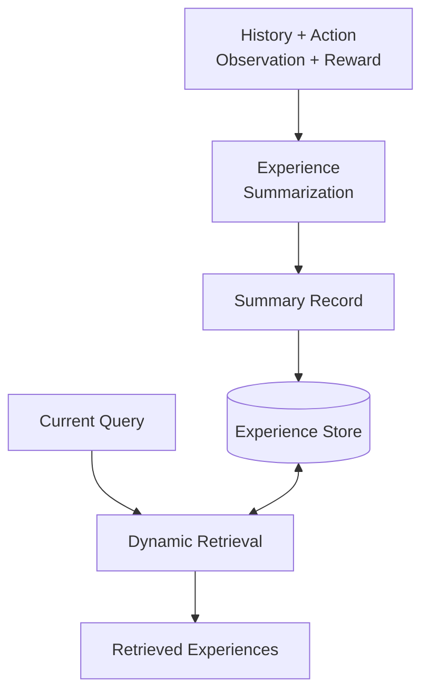
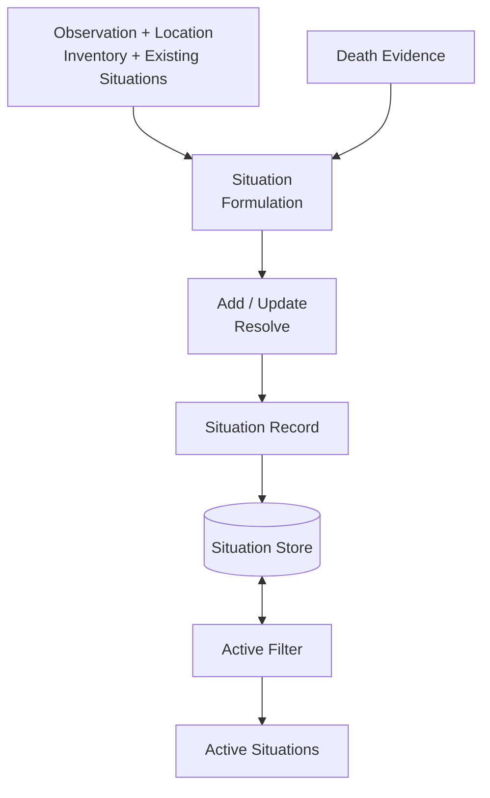
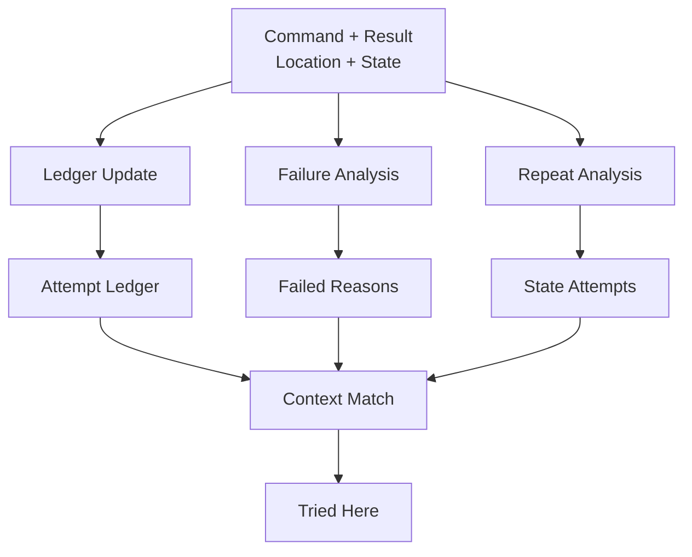
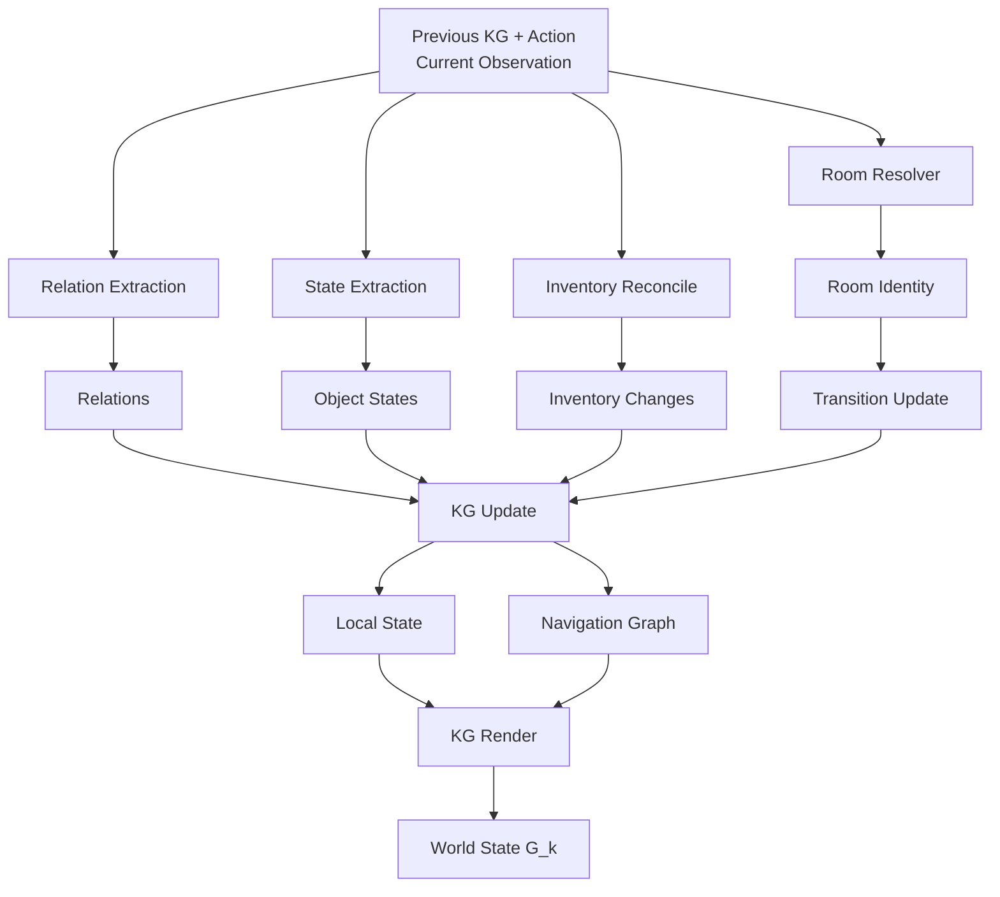
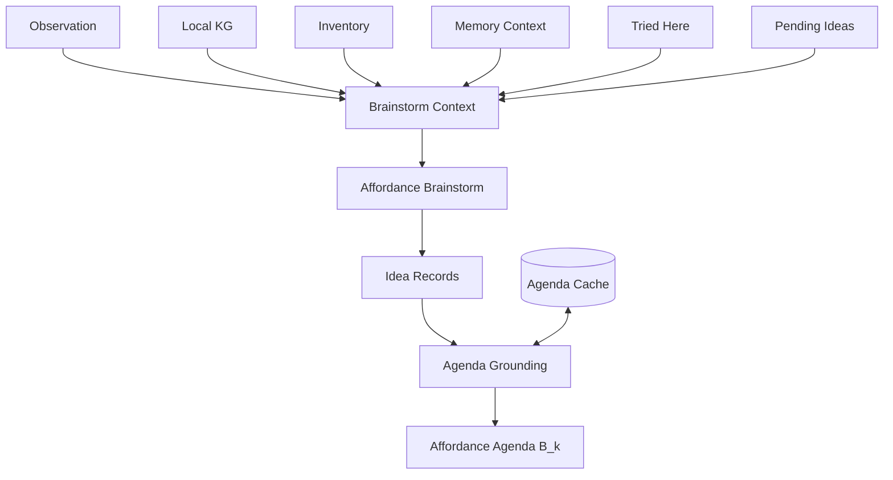
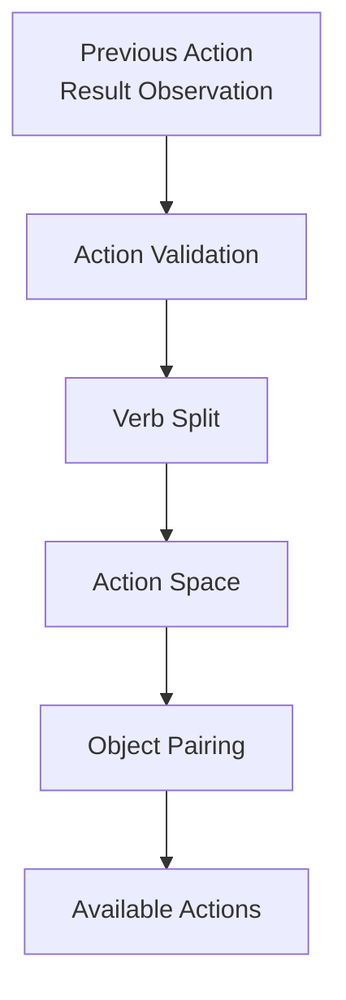

# LPLH2 Architecture Diagram Guide

This document is a drawing specification for a dissertation figure describing
the extended LPLH2 interactive-fiction agent. It covers the system layout,
module flows, visual notation, recommended labels, and suitable icons.

The central architectural principle is that auxiliary mechanisms provide
grounded evidence and suggestions, while the final Action Selector retains
control over the next game command.

## 1. Recommended Overall Layout

Place the Game Environment at the top, the Routing Gate directly below or next
to it, the three principal modules around the centre, and the Action Selector at
the bottom centre. Keep the inherited Action Space visible as a separate module.



Use solid arrows for data and dashed arrows for routing or activation decisions.

## 2. Visual Grammar

Use the same visual language throughout the figure.

| Meaning | Recommended representation | Icon search terms |
|---|---|---|
| LLM operation | Coloured rounded rectangle with a robot, AI chip, or brain icon | `AI model`, `robot head`, `AI chip` |
| Deterministic operation | Plain rounded rectangle | `process`, `settings`, `gears` |
| Single record | Document icon | `document outline`, `record file` |
| Record collection | Stacked documents | `document stack`, `file collection` |
| Persistent storage | Database cylinder | `database`, `data storage` |
| Temporary cache | Clipboard with clock or storage tray | `temporary storage`, `clipboard clock` |
| Retrieval | Document or database with magnifier | `database search`, `document search` |
| Filtering | Funnel | `filter funnel` |
| Context composition | Circled plus, `\oplus` | `circled plus`, `merge` |
| Structured world state | Connected-node graph or map with data card | `knowledge graph`, `network nodes` |
| Data flow | Solid arrow | No icon required |
| Control signal | Dashed arrow | No icon required |
| Bidirectional store access | Double-headed arrow | No icon required |

Do not use a Boolean AND gate to combine module outputs. The modules are not
logical conditions. Use a circled plus and label it `Context Merge`.

## 3. Memory Module

The Memory Module contains three genuinely separate branches: Experience
Memory, Situation Memory, and Action Memory. Their selected outputs are composed
into one prompt context, but they do not share one database or one retrieval
method.

### 3.1 Experience Memory



The summary record may be labelled with one of these compact kinds:

- `Achievement`: an exact score-changing success.
- `Death`: a grounded fatal event and future warning.
- `Route`: a confirmed navigation fact.
- `State Change`: a durable object or environmental change.
- `Narrative`: a reusable clue, instruction, property, or rule.
- `Enabler`: a non-scoring action that enabled a later achievement.

Recommended icons:

| Flow step | Recommended icon |
|---|---|
| History and observation | Terminal page or stacked game-log pages |
| Reward event | Trophy, star with `+10`, or score counter |
| Experience Summarization | Document and pen inside the LLM process box |
| Summary Record | Document with positive, negative, and neutral marker lines |
| Experience Store | Database cylinder |
| Dynamic Retrieval | Database or document with magnifying glass |
| Retrieved Experiences | Stacked documents with one highlighted or checked |

The retrieved output can also represent derived memory context such as known
rewards, reward enablers, and room danger warnings.

### 3.2 Situation Memory



Situation records may represent an unresolved local problem or a preparation
goal inferred from repeated grounded hazard evidence. A compact record can show:

- location;
- unresolved situation;
- possible solution;
- creation epoch and step.

Recommended icons:

| Flow step | Recommended icon |
|---|---|
| Problem input | Warning triangle beside a text document |
| Location grounding | Map pin attached to a document |
| Situation Formulation | Warning document and pen inside the LLM process box |
| Add | Document with plus sign |
| Update | Document with pencil |
| Resolve | Document with checkmark |
| Situation Record | Stacked warning documents |
| Situation Store | File drawer or database cylinder |
| Active Filter | Funnel with checkmark |
| Active Situations | Warning-document stack with inactive records faded |

The recommended two-word process label is `Situation Formulation`. Avoid
`Situation Manager`, because the former describes the LLM's semantic task more
precisely.

### 3.3 Action Memory

Action Memory contains three related mechanisms. They share the purpose of
reducing pointless repetition but preserve different evidence.



- `Attempt Ledger` records factual command counts and outcomes by room.
- `Failed Reasons` records why rejected commands failed at that location.
- `State Attempts` records commands that were invalid or unproductive under the
  same compact world state.
- `Context Match` selects the records relevant to the current location and state.
- `Tried Here` is their combined prompt representation.

Recommended icons:

| Flow step | Recommended icon |
|---|---|
| Command | Terminal prompt such as `> open door` |
| Command result | Returned terminal line or speech bubble |
| Ledger Update | Table or grid with a numeric counter |
| Attempt Ledger | Spreadsheet or checklist with attempt counts |
| Failure Analysis | Command line with a cross and magnifier |
| Failed Reasons | Document with a cross and explanatory lines |
| Repeat Analysis | Circular arrow around a small state card |
| State Attempts | Snapshot or camera combined with command history |
| Context Match | Matching cards, target, or magnifier over records |
| Tried Here | Ranked terminal checklist with familiarity labels |

### 3.4 Memory Output

Represent memory composition as:

```text
M_k = E_k^q \oplus S_k^active \oplus A_k^relevant
```

Use a stacked document with three visible tabs for the final `Memory Context`:

1. experience;
2. situation;
3. action.

The composed context includes retrieved experiences, known rewards, danger
history, active situations, and tried-command evidence. These remain separately
labelled sections when supplied to the Action Selector.

## 4. KG-Map

The KG-Map is one evolving world model with several update paths. Do not draw
its mechanisms as independent databases.



`Local State` contains the current location, authoritative inventory, visible
objects with states, confirmed exits, blocked exits, and untried exits.

`Navigation Graph` contains real room destinations for cardinal directions and
confirmed non-cardinal transitions such as `enter window -> Kitchen` and
`climb tree -> Up a Tree`.

Recommended icons:

| Flow step | Recommended icon |
|---|---|
| Previous KG | Connected-node graph |
| Room Resolver | Map pin combined with fingerprint or ID card |
| Room Identity | Map pin with an ID tag |
| Relation Extraction | Three nodes showing subject to relation to object |
| Relations | Small linked boxes such as `room -> has -> object` |
| State Extraction | Eye over an object or object tag with state toggle |
| Object States | Object cards labelled `open`, `moved`, or `lit` |
| Inventory Reconcile | Backpack with plus and minus arrows |
| Inventory Changes | Backpack or container with item symbols |
| Transition Update | Two map pins connected by a directional arrow |
| Non-cardinal transition | Door or window with an arrow passing through |
| KG Update | Node graph with a plus symbol |
| Local State | Room or floor-plan containing small objects |
| Navigation Graph | Network of map pins and directional arrows |
| KG Render | JSON document or code-bracket document |
| World State | Map combined with a structured-data document |

Use the common LLM-operation colour for Room Resolver, State Extraction, and
Inventory Reconcile. Relation Extraction can retain the original LPLH orange
colour to identify the fine-tuned FM component.

## 5. Object-Interaction Brainstorming

Brainstorming is a single pipeline with a short-lived, location-and-state-aware
agenda cache. It is not a set of independent memory stores.



An idea record can include a target object or condition, a concrete reason,
commands to try, and an optional preparation relationship. Agenda Grounding
represents normalization, deduplication, target grounding, inventory checks,
preparation validation, tried-command filtering, and pending/completed status.

Recommended icons:

| Flow step | Recommended icon |
|---|---|
| Brainstorm Context | Funnel receiving a map, backpack, documents, and observation |
| Affordance Brainstorm | Lightbulb combined with gear, wrench, or AI chip |
| Idea Records | Small sticky notes or lightbulb cards |
| Object idea | Object cube with an action arrow |
| Inventory idea | Backpack with wrench |
| Condition idea | Warning or room icon with question mark |
| Preparation idea | Toolbox or resource pointing toward a warning |
| Agenda Grounding | Funnel with checkmark and cross |
| Deduplication | Overlapping documents becoming one |
| Agenda Cache | Clipboard with clock or temporary-storage tray |
| Affordance Agenda | Ranked checklist numbered from one to five |
| Pending command | Empty checkbox |
| Tried command | Crossed or checked checkbox |
| Completed command | Checkmark |

The brainstormer does not receive the learned action space. This allows it to
suggest useful novel verbs. The inherited action space is supplied separately to
the final Action Selector.

## 6. Auxiliary LLM

Use a switchboard, funnel with branching arrows, or router icon inside an LLM
process box labelled:

```text
Routing Gate
Auxiliary LLM
```

Its input is the latest completed step: previous action, resulting observation,
current location, inventory, visible objects, recent attempts, score change, and
active situations.

Represent its compact output as a JSON or checklist document containing:

```text
Outcome
Terminal
Location
Summary
Inventory
World State
Transition
Situation
Brainstorm
Focus
```

Draw dashed arrows from the Routing Gate to the mechanisms it activates. It does
not choose the next command. Action Memory receives the completed action outcome
directly and should not be shown as dependent only on a brainstorm or summary
trigger.

## 7. Main LLM

Use the robot icon from the seed-paper figure and label it:

```text
Action Selector
Main LLM
```

The Action Selector receives:

```text
Current Observation
World State
Memory Context
Affordance Agenda
Action Space
Score and History
```

Its conceptual decision is:

```text
a_k = LLM_a(o_k, G_k, M_k, B_k, AS_k, H_k)
```

Use a terminal icon for its output, for example:

```text
> move rug
```

Optionally place a circular-arrow/check icon beside the command output to depict
the repeat self-check. The final arrow returns the selected command to the Game
Environment.

## 8. Inherited Action Space

Although the dissertation focuses on the three extended modules, retain the
original LPLH Action Space because it remains an input to the Action Selector.



Recommended icons:

| Flow step | Recommended icon |
|---|---|
| Action Validation | Command terminal with checkmark or cross |
| Verb Split | Scissors dividing a command into labelled pieces |
| Verb Space | List of command verbs |
| Object Space | Row of object tokens |
| Object Pairing | Puzzle pieces or linked verb/object tokens |
| Available Actions | Compact command list supplied to the Action Selector |

Label this module `Inherited LPLH` or use a lighter colour so the reader can
distinguish the retained component from the extensions introduced in LPLH2.

## 9. Colour and Styling Recommendation

| Component | Suggested colour role |
|---|---|
| LLM processes | Pink or magenta |
| Memory records and arrows | Purple |
| KG and world-state mechanisms | Orange |
| Brainstorming and agenda | Green |
| Inherited action space | Blue |
| Persistent stores | Dark grey or black |
| Game Environment | Neutral grey |
| Main Action Selector | Dark outline with a distinctive robot icon |

Use identical stroke widths and one SVG icon family. Do not communicate meaning
through colour alone: retain text labels, dashed versus solid lines, and distinct
record/storage shapes so the figure remains readable in grayscale.

## 10. Recommended Box Labels

These labels stay within one or two words wherever possible:

```text
Routing Gate
Memory Module
Experience Memory
Situation Memory
Action Memory
Experience Summary
Dynamic Retrieval
Situation Formulation
Active Filter
Ledger Update
Failure Analysis
Repeat Analysis
Context Match
Room Resolver
Relation Extraction
State Extraction
Inventory Reconcile
Transition Update
KG Update
Local State
Navigation Graph
Brainstorm Context
Affordance Brainstorm
Agenda Grounding
Agenda Cache
Affordance Agenda
Context Merge
Action Selector
```

## 11. Figure Caption Draft

> Overview of the extended LPLH2 framework. Following each interaction with the
> game environment, an auxiliary routing LLM determines which supporting
> mechanisms require execution. The memory module retrieves relevant experience,
> situation, and action evidence; the KG-map maintains local world state and
> navigation knowledge; and the object-interaction brainstorming module produces
> a grounded affordance agenda. These outputs, together with the inherited action
> space and current observation, are provided to the main action-selection LLM,
> which retains responsibility for selecting the next executable command.
